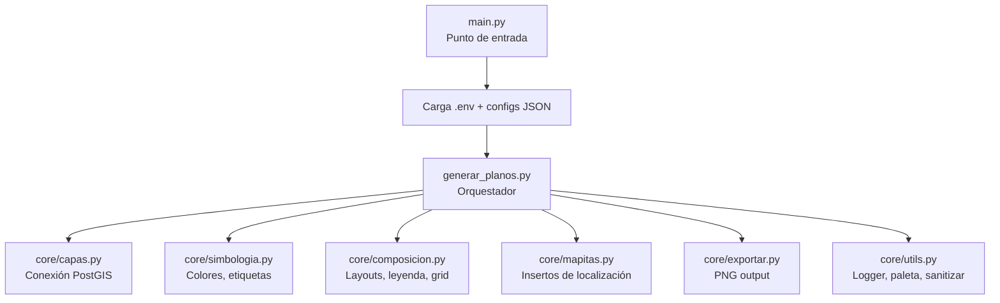

# Resumen del Proyecto: Planos_auto

## ¿Qué Hace?

**Planos_auto** es un generador automático de planos cartográficos para la empresa **SINERGIA**. Se ejecuta dentro de la consola Python de **QGIS** y produce composiciones cartográficas (planos en PNG) a partir de:

- **Datos geoespaciales** almacenados en una base de datos **PostGIS**
- **Plantillas de diseño** (`.qpt`) con el formato corporativo
- **Estilos de simbología** (`.qml`) predefinidos por capa

El proyecto actual está configurado para el cliente **SONITRONIES S DE RL DE CV** y genera ~11 planos temáticos para una **Licencia Ambiental Integral**, incluyendo:

| Tipo | Planos |
|------|--------|
| **Corporativos** | Suelos, Geología, Clima, Vegetación, Hidrología Superficial, Vértices |
| **Figuras** | POET Sonora, AICA, ANP Estatales, Regiones Hidrológicas y Terrestres Prioritarias |

Cada plano incluye automáticamente **3 mapas de localización** (Nacional → Estatal → Municipal).

---

## ¿Cómo Funciona?

### Arquitectura



### Flujo de Ejecución

1. **Inicio** ([main.py](file:///home/leonardo/Codigos/Planos_auto/main.py)): Se ejecuta en la consola de QGIS. Carga variables de entorno (`.env`), configuración global (`global.json`) y del proyecto activo (`plantilla.json`). Ensambla un diccionario `CONFIG` unificado.

2. **Orquestación** ([generar_planos.py](file:///home/leonardo/Codigos/Planos_auto/generar_planos.py)):
   - Localiza el polígono de trabajo seleccionado en QGIS
   - Carga un mapa base satelital (Google Satellite)
   - Prepara capas de referencia para los mapitas (estados/municipios desde PostGIS)
   - **Loop principal**: para cada capa definida en el JSON del proyecto:

3. **Por cada capa** (pasos a–k en el loop):
   - **a.** Carga datos desde PostGIS filtrando por bbox del polígono
   - **b.** Clona la plantilla QPT como nueva composición
   - **c.** Calcula el extent a la escala configurada
   - **d.** Sanea geometrías (`fixgeometries`)
   - **e.** Reproyecta al CRS del proyecto
   - **f.** Crea máscara de recorte con el extent visible
   - **g.** Recorta los datos al área visible (`clip`)
   - **h.** Aplica simbología (QML, categorizado, o hereda del original)
   - **i.** Extrae centroides para etiquetas PAL
   - **j.** Configura el map item con las capas visibles
   - **k.** Exporta a PNG a 200 DPI

4. **Mapitas de localización** ([core/mapitas.py](file:///home/leonardo/Codigos/Planos_auto/core/mapitas.py)):
   - Detecta estado y municipio por intersección espacial con PostGIS
   - Genera 3 niveles: Nacional (México con estado resaltado), Estatal (municipios), Municipal (zoom + punto)

### Configuración por Capas

Cada capa se configura en el JSON del proyecto con estos campos clave:

```json
{
  "tabla_postgis":   "nombre_tabla",      // Tabla en PostGIS
  "nombre_plano":    "Plano. Título",     // Título del plano
  "escala":          5000,                // Escala cartográfica
  "campo_categoria": "campo_color",       // Campo para colores categorizados
  "layout_nombre":   "Plantilla_figuras", // Plantilla alternativa (opcional)
  "estilo_qml":      "archivo.qml",       // Estilo QML personalizado (opcional)
  "sin_bbox_filter": true                 // Carga sin filtro espacial (opcional)
}
```

---
## Estado de Errores y Mejoras

*Actualizado: julio 2026.*

### ✅ Corregidos

| # | Problema | Solución aplicada |
|---|----------|-------------------|
| 1 | Capas duplicadas de mapitas en el proyecto | `_reg()` registra una sola vez; además se limpian las `ref_*` de corridas anteriores al inicio de `preparar_capas_referencia()` |
| 2 | EPSG:32612 hardcodeado en el filtro bbox | El buffer de 5.5 km ahora se calcula sobre `geography` (metros reales en cualquier zona UTM) — [capas.py](core/capas.py) |
| 3 | `utils.py` importaba QColor pese al docstring | `color_para_categoria()` devuelve hex `#rrggbb`; `utils.py` ya no depende de QGIS y es testeable con Python normal |
| 4 | Ubicación no detectada rompía los mapitas | Si no hay `cve_ent`, los mapitas se omiten con warning |
| 5 | `KeyError` si una capa no define `escala` | Fallback a 1:5 000 con warning en `generar_planos.py` |
| 6 | `NameError` latente de `campo_cat` al usar `estilo_qml` | `campo_cat` se define antes de la rama QML/categorizado |
| 7 | Global.json pisaba valores del proyecto | En `main.py` el proyecto ahora tiene prioridad (`dpi`, `layout_nombre`, `coordenadas`, `ids`, `mapitas`, `fecha_plano`) |
| 8 | Fecha dependiente del locale del sistema | Meses en español hardcodeados (`_MESES_ES`) |
| 9 | Falsos avisos de "extent MUY GRANDE" en figuras 1:1M | El umbral de `validar_extent()` ahora es proporcional a la escala |
| 10 | FileHandlers del logger nunca se cerraban | `crear_logger()` cierra los handlers previos antes de limpiarlos |
| 11 | Un error en un plano abortaba toda la corrida | Loop principal con try/except por plano; los fallidos se registran y aparecen en el índice HTML |
| 12 | URI PostGIS armada a mano y `key` sin validar | `capas.py` usa `QgsDataSourceUri` + `valida_id` en `key` |
| 13 | `mapitas.py` ignoraba tablas/campos de `global.json` | `_params_cartografia()` lee la config (con defaults) y valida identificadores |
| 14 | Capas amplias se saneaban/reproyectaban completas | Pre-filtro `extractbyextent` antes de `fixgeometries`/`reproject` |
| 15 | Vértices: crash con geometría vacía; multipartes silenciadas | `extraer_vertices_poligono` valida vacío y numera todas las partes |
| 16 | Recarga de módulos en orden alfabético dejaba refs viejas | `core.utils` y `core.configuracion` se recargan primero |
| 17 | Sin validación de esquema en los JSON de proyecto | `_validar_capas()` en `core/configuracion.py` |
| 18 | Plugin: reentrancia y widget de log destruido a media corrida | Flag `en_ejecucion` + guard en `_HandlerLogQt.emit` + pre-check de polígono |

### ⏳ Pendientes (baja prioridad)

1. **Los QML de `estilos/` no se usan**: existen estilos para Clima, Geología, Suelos, Vegetación e Hidrología pero ninguna capa del JSON tiene `"estilo_qml"`. Decidir si conectarlos o eliminarlos.
2. **Patrón SQL por interpolación** en los filtros (`bbox_wkt`, claves de mapitas): los identificadores ya se validan y los valores se escapan, pero el patrón sigue siendo por concatenación (inherente al parámetro `sql=` del proveedor PostGIS de QGIS).
3. **Mejoras UX del plugin** (opcionales): combo de capas para `capa_poligono`, reescalado de planos en modo edición, recordar último proyecto/DPI con `QSettings`.
